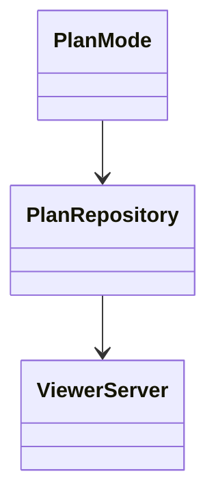
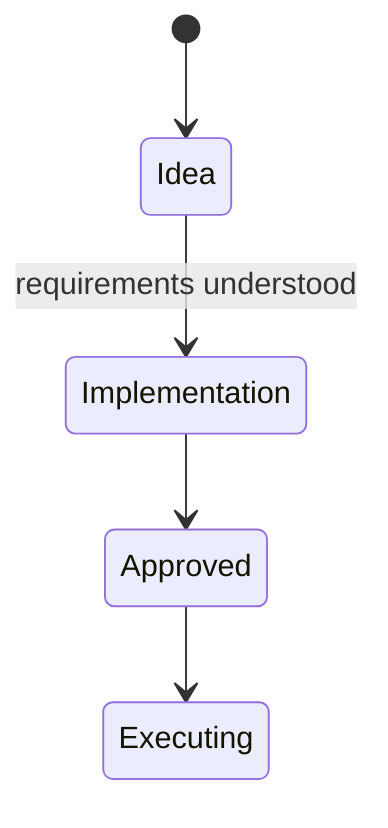

# Pi Visual Plan

A project-local pi extension that separates idea discovery from implementation design, writes the plan to Markdown, and renders Mermaid UML on a live localhost site.

## Install

From this directory:

```bash
npm install
```

Then start pi in the project root. Because this extension is under `.pi/extensions/`, pi discovers it after the project is trusted. Use `/reload` after changing extension code.

## Commands

- `/visual-plan on` — enter read-only planning mode
- `/visual-plan off` — leave planning mode and restore tools
- `/visual-plan open` — open the localhost viewer
- `/visual-plan status` — show phase, file, and URL
- `/visual-plan execute` — validate and begin an approved implementation plan
- `/visual-plan` — toggle the mode

Start directly with `pi --visual-plan`. The default viewer is `http://127.0.0.1:4317`; set `PI_VISUAL_PLAN_PORT` to choose another port. If the default is occupied, the extension chooses a free port.

## Workflow

1. Enable the mode and discuss the product idea. The agent records prose only.
2. Once goals and constraints are understood, the agent moves to implementation design.
3. The implementation plan must contain Mermaid `classDiagram` and/or `stateDiagram-v2` fenced blocks.
4. Open the live viewer. It refreshes when `.pi/plans/plan.md` changes.
5. Review the plan and run `/visual-plan execute` when approved.

Planning mode disables pi's `edit`, `write`, and `bash` tools. Its dedicated `visual_plan_write` tool can only replace the plan file and validates stage rules before writing.

## Mermaid example

````markdown



````

The viewer serves only on `127.0.0.1`, uses local npm assets (no CDN), disables raw HTML in Markdown, and configures Mermaid's strict security mode.
